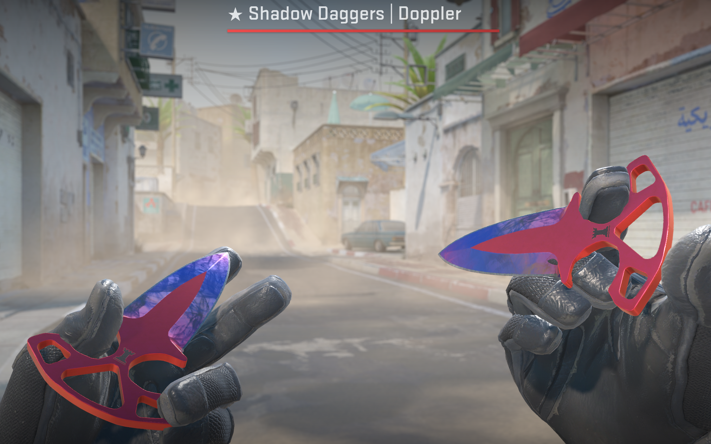

## Gaming with Friends

I play Counter-Strike almost every night with my boyfriend and our buddies in our discord. One friend in particular, who I've known for a few years now, got us excited to play and get really into it. Funny enough, I've owned [Counter-Strike](https://www.counter-strike.net/) for many years (before it became free as CS:GO), but hardly played as I didn't have friends back then to learn with. Now I can't get enough and am happy to learn the maps as I go (right now we all know Dust II pretty well). Lately my buddies all bought skins here and there, starting with a cheap pistol or rifle skin, up to getting new agents (I'm up to 3 now) and my long time friend said he ws going to buy a knife. If anyone knows Counter-Strike, non-default knives are pretty rare and it's a flex to own one. The virtual Steam market for CS2 is insane, and we've all caved at some point with our virtual purchases. My boyfriend even got a cool knife the other day, and it's awesome to see him flip it around and have fun with it. 

As you've might have read, I blogged about a huge life goal - [paying off my student loans](https://binarydigit.cafe/notes/loanbegone/)! And so, my friend who was also excited for my news was like "...So what will you do, or buy, to celebrate?"

And so I knew exactly what he was asking. Will I finally get a knife, the flexiest of all flexes in the Counter-Strike world.

As far as knives go, I'm a newbie, first and foremost. I remember seeing someone rock the dual-handed shaddow daggers, even though they are a bit meme-d on being called *something else* (which I'll let you search for 🤣). I like the color schemes, the small shape, that they are two handed, and of course have a cool animation. I browsed the Steam market in shock of the prices for them. I had a gift card in my wallet already, plus I was willing to spend *a little bit* of money that I would have spent on a student loan payment, towards this celebratory item.  After much back and forth, I ended up absolutely falling in love with a set that of course, ended up being **twice** more than I wanted to spend. 

## "Buy nice or buy twice" as they say.

If it wasn't this, it would have been an awesome bag, or Jordans, new earrings, or a new console. But, I figure let me have fun in the digital world and rock an item that I would have never bought before and remember this moment in time where I spent adult money on an item that I could flex with just because, and if I wanted to, at least, sell back on the Steam market. 

Introducing the...

# **Shaddow Daggers Doppler Phase 1!**

Here's a youtube video if you want to see the animation:



Now I need to get good 🤓 And no, I won't be your Steam friend unless I know you 🤣