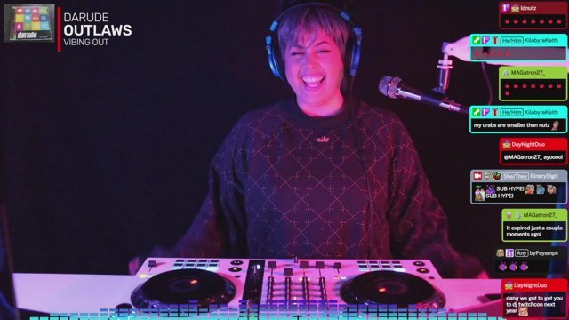

I can't believe it's 2024! These past couple of months have been good so far. My mindset has changed since I feel better in terms of health and knowing where I stand with things to take care of. I feel like I'm in control of my mind, body, and goals. 

## Twitch

For Twitch, I set up the downstairs space as a "tiny studio" for my DJ mix streams. I've already gone live twice and have had a blast! I look forward to just walking downstairs, booting up, and easily starting a stream. It makes a huge difference when you a) aren't fatigued like before b) you have settings you don't need to change. The problem I had with doing two different styles of streams in my office were the constant changing of settings and programs. So that's resolved! I also got some awesome lights for the background. I'll update more things I'm sure.

## Health

I'm taking medication to handle my pre-diabetes, and have lost 5 pounds since November. It's very slow, and with the holidays I got a bit derailed, but I didn't gain anything back at least. Time to start back up. I might create a subdomain/micro blog to keep track of how I'm feeling that's not a standard part of this cafe. It's important for me to keep track of things since I just get back into bad habits way too easily. I don't have a choice any longer!

## Career

I'm not quite sure what to do here, but I know I need to start thinking about another job or way to make the same amount of money I'm currently making. I still enjoy some parts of tech, but really don't like the way many things are going, and don't want to do what I've done before (mainly in the support space). I'm going to focus on fun projects and pay attention to social media like Mastodon, discord, and the better parts of "mainstream" social media. It would be cool to work in the indie web space, or finally get a creative job. ...somehow :) 